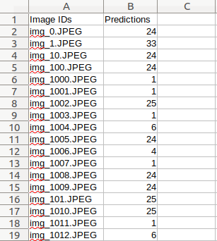

# VIPriors Image Classification Challenge

Maintainer: Robert-Jan Bruintjes (r.bruintjes@tudelft.nl)

We present the "Visual Inductive Priors for Data-Efficient Computer Vision" challenge. We offer four challenges, where models are to be trained from scratch, and we reduce the number of training samples to a fraction of the full set.

This challenge is the image classification challenge. We provide a subset of the Imagenet dataset to train on. We will evaluate all models submitted to the challenge on Imagenet validation data.

# Dataset

The task to be performed is image classification, predicting class labels. The training and validation data are subsets of the training split of the Imagenet 2012. The test set is taken from the validation split of the Imagenet 2012 dataset. Each data set includes **50 images per class**.

As a note: **DO NOT train on Imagenet validation data**. Please use the tooling described here to set up your training, validation and test data to avoid accidentally training on test data.


## Validation

We provide an evaluation script to test your model over the validation set. Note that this script cannot be used to evaluate models over the testing set, as we do not provide labels for the test set. It is good practice to ensure your predictions work with this script, as the same script is used on the evaluation server.

## Dataset Generation

In order to use the dataset, first you need to download to ImageNet dataset (2012). After that, you need to run the python script below: 
`python3 generate_images.py <imagenet_train_directory_path> <imagenet_50_directory_path>`
Example:
`python3 generate_images.py "/home/user/imagenet/train" "/home/user/vipriors/"`

# Submission

The evaluation server is hosted using CodaLab. Submitting to the challenge requires a CodaLab account.
[
Please find the evaluation server here.](https://codalab.lisn.upsaclay.fr/competitions/4694)

To participate in the challenge one uploads a file of predictions over the challenge test set to the evaluation server. Generate these predictions by inferring your model over our test set. 

# Baselines

We trained 2 simple baseline models: a Resnet-50 with Same-Conv and Full-Conv models trained from scratch for 90 epochs (using hyperparameters of [original pytorch implementation](https://github.com/pytorch/examples/tree/master/imagenet)).

|        Model        | Checkpoint | Testing Accuracy (%) |
|:--------------------|:----------:|:--------------------:|
| Resnet-50 Full-Conv |      [link](https://drive.google.com/file/d/1VqlV10kFDJsSwos1B7HsbHLSjw50GuGq/view?usp=sharing)     |         31.16        |
| Resnet-50 Same-Conv |      [link](https://drive.google.com/file/d/1EgYFbyJqCmr1uwx0EKW7zKd8pBIBNxcw/view?usp=sharing)     |         26.39        |

# Sample Code
If you want to check the baselines, we provide two baseline models with pytorch implementation which supports multi-gpu training.

You can also refer to the baseline code in `main.py`, which includes example code on how to store prediction results as a submission file.

## 1. Same-Convolution:

Model with the Same-Convolution contains pytorch Resnet and VGG architectures with same padding. 

## Usage
```
usage: main.py [-h] [--arch ARCH] [-j N] [--epochs N] [--start-epoch N] [-b N]
               [--lr LR] [--momentum M] [--weight-decay W] [--print-freq N]
               [--resume PATH] [-e] [-t] [-sub] [--pretrained] [--world-size WORLD_SIZE]
               [--rank RANK] [--dist-url DIST_URL]
               [--dist-backend DIST_BACKEND] [--seed SEED] [--gpu GPU]
               [--multiprocessing-distributed]
               DIR

PyTorch ImageNet Training

positional arguments:
  DIR                   path to dataset

optional arguments:
  -h, --help            show this help message and exit
  --arch ARCH, -a ARCH  model architecture: alexnet | densenet121 |
                        densenet161 | densenet169 | densenet201 |
                        resnet101 | resnet152 | resnet18 | resnet34 |
                        resnet50 | squeezenet1_0 | squeezenet1_1 | vgg11 |
                        vgg11_bn | vgg13 | vgg13_bn | vgg16 | vgg16_bn | vgg19
                        | vgg19_bn (default: resnet18)
  -j N, --workers N     number of data loading workers (default: 4)
  --epochs N            number of total epochs to run
  --start-epoch N       manual epoch number (useful on restarts)
  -b N, --batch-size N  mini-batch size (default: 256), this is the total
                        batch size of all GPUs on the current node when using
                        Data Parallel or Distributed Data Parallel
  --lr LR, --learning-rate LR
                        initial learning rate
  --momentum M          momentum
  --weight-decay W, --wd W
                        weight decay (default: 1e-4)
  --print-freq N, -p N  print frequency (default: 10)
  --resume PATH         path to latest checkpoint (default: none)
  -e, --evaluate        evaluate model on validation set
  -t, --testing         test model on testing set
  -sub, --submission    submission output as csv file
  -ecs                  evaluate class specific model on validation set
  --pretrained          use pre-trained model
  --world-size WORLD_SIZE
                        number of nodes for distributed training
  --rank RANK           node rank for distributed training
  --dist-url DIST_URL   url used to set up distributed training
  --dist-backend DIST_BACKEND
                        distributed backend
  --seed SEED           seed for initializing training.
  --gpu GPU             GPU id to use.
  --multiprocessing-distributed
                        Use multi-processing distributed training to launch N
                        processes per node, which has N GPUs. This is the
                        fastest way to use PyTorch for either single node or
                        multi node data parallel training
```
Single node, multi-gpu training:

`python main.py -a resnet50 --dist-url 'tcp://127.0.0.1:FREEPORT' --dist-backend 'nccl' --multiprocessing-distributed --world-size 1 --rank 0 [imagenet-folder with train and val folders]`

For submission you can use example code:

`python main.py -a resnet50 -sub True -t --resume '50/resnet50_checkpoint.pth.tar' imagenet_50`

## 2. Full-Convolution:

This implementation includes pytorch Resnet and VGG architectures with Full-Convolution (more information please check the CVPR 2020 paper: ["On Translation Invariance in CNNs: Convolutional Layers can Exploit Absolute Spatial Location"](https://arxiv.org/abs/2003.07064))

The usage of Full-Conv is similar as Same-Conv. You only need to change the architecture name.

`python main.py -a resnet50_FConv --dist-url 'tcp://127.0.0.1:FREEPORT' --dist-backend 'nccl' --multiprocessing-distributed --world-size 1 --rank 0 [imagenet-folder with train and val folders]`

For submission you can use example code:

`python main.py -a resnet50_FConv -sub True -t  --resume '50/resnet50_FConv_checkpoint.pth.tar' imagenet_50 `

# Evaluation

You need to submit a .csv file as the format of Figure below:


